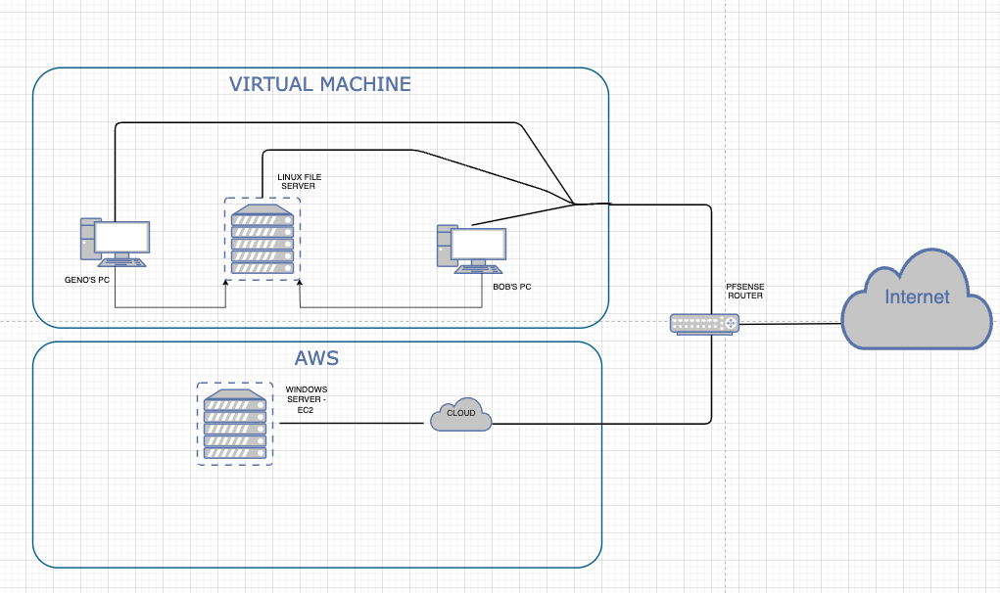

# The Night Shift Final Project

----
Group Members: Cameron Berry, Lilian Mburu, Sam Allan, Jasmine Garcia, Osaremeh Abel

# Scope:

As cybersecurity experts this project provideed opportunities to practice and polish a variety of acuquired skills . By working on a project that can be scaled up or down depending on project complexities motivated us to work on both methodically and systematically. This project required a diverse set of skills not only allowed each of us to have fun but provided a great way to exercise our skills as cybersecurity experts.

Our primary objective was to create a small business working environment using virtual machines. The core of the environment comprised of:

1. A pfSense router
2. A Linux file server
3. A Windows 2016 server hosted in AWS EC2 instance
4. Windows 10 machines for use by Flyhome Exec
    * Each machine will have L: drive which is a mounted linux file share network
    * Each machine will have Thunderbird software installed
    * Each machine will be configured with remote desktop protocol (RDP) for easy access to A Windows 2016 server
    * Each machine will be configured to automatically backup the user profile and the OS to the linux file share

# Techinical Description:

Our network is divided into 2 parts. The first group are all the virtual machines. The second is our AWS EC2 Windows server. All machines utilize the pfSense router which is configured to run as an internal network. Only the Windows 10 machine IPs have access to the Linux file server. Each machine has it's own profile configured in the Linux file server. The Windows 2016 server is shared by multiple users for special projects.

# Stretch goals:
* Creating a variety of scripts to automate certain tasks such as adding new profiles to linux file share, automating backups
* Creating a network topology for our project
* Creating a detailed and well documented README file for our project
* Creating static IP addresses for the Windows 10 VMs and the Linux file server

